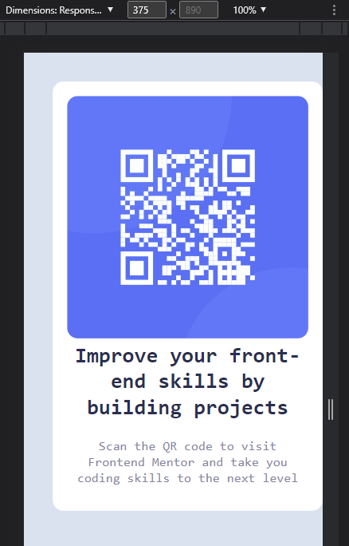
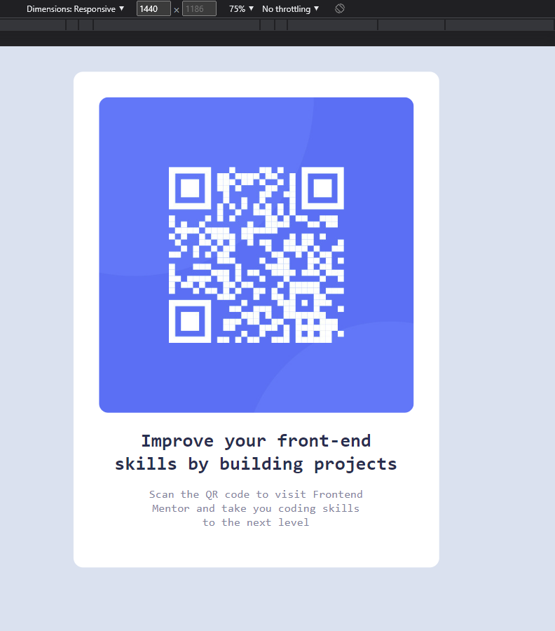

# Make It Real - QR code component

This is a solution to the QR code component project of the Make It Real course.

## Table of contents

- [Overview](#overview)
  - [The challenge](#the-challenge)
  - [Screenshot](#screenshot)
- [My process](#my-process)
  - [Built with](#built-with)
  - [What I learned](#what-i-learned)
  - [Continued development](#continued-development)
  - [Useful resources](#useful-resources)
- [Author](#author)
- [Acknowledgments](#acknowledgments)


## Overview

### The challenge

Users should be able to:

- Visualize the QR component in desktop a mobile resolution properly

### Screenshot




## My process

### Built with

- HTML5
- CSS
- Flexbox
- Mobile-first workflow

### What I learned

In this project we learn how to fit an image into different resolutions.

```css
.container {
  display: flex;
  flex-direction: column;
  border-radius: 15px;
  background-color: var(--white);
  text-align: center;
  margin: auto;
  justify-content: center;
  object-fit: contain;
  width: 375px;
  padding: 20px;
}

img {
  border-radius: 15px;
  max-width: 100%;
  max-height: 100%;
}
}
```


### Continued development

We need to continue learning about how flexbox works.

### Useful resources

- [Resource 1](https://stackoverflow.com/questions/3029422/how-do-i-auto-resize-an-image-to-fit-a-div-container) - This helped me to know hot to resize and image to fit a container.

## Author

- Juan Sebastián Muñoz


## Acknowledgments

Thanks to Salomón and German.
